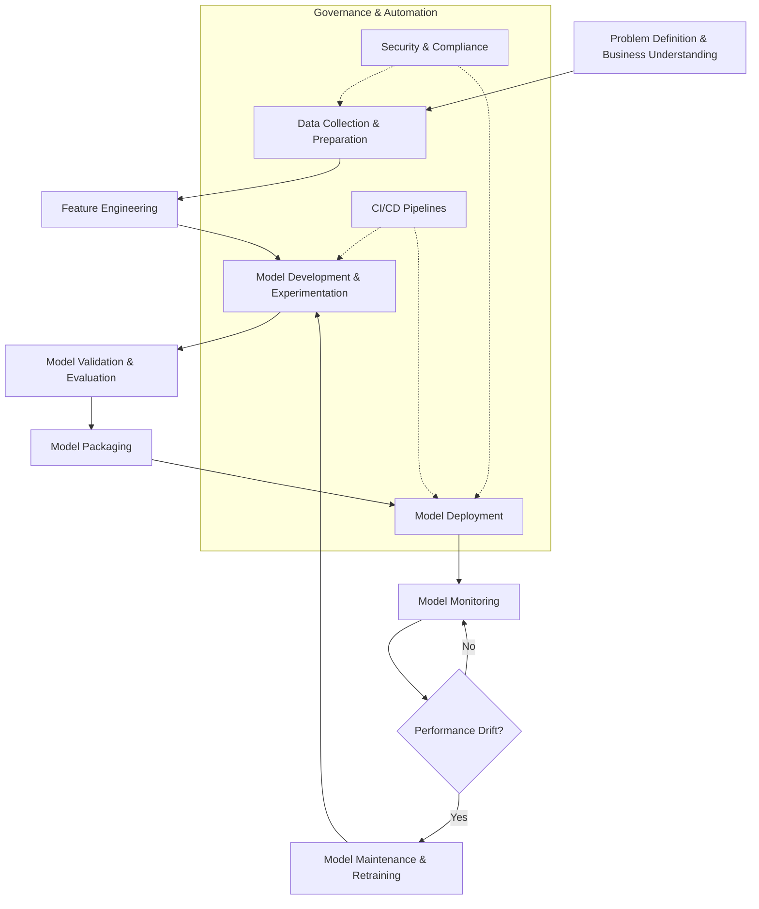

# MLOps 101: A Basic Tutorial

This repo serves as a guide to MLOps.

### Explanation of Activities

1.  **Problem Definition & Business Understanding**: This is the foundational stage where specific business objectives are identified (e.g., "predict stock price movements"). Success metrics are defined here to guide the rest of the project.

2.  **Data Collection & Preparation**: Raw data is gathered from various sources. This stage involves cleaning, formatting, and versioning the data to ensure it is usable for training.

3.  **Feature Engineering**: Raw data is transformed into meaningful features that machine learning algorithms can understand. This includes normalization, encoding, and selecting the most relevant variables.

4.  **Model Development & Experimentation**: Data scientists select architectures, train models, and tune hyperparameters. Experiment tracking is crucial here to log parameters and results.

5.  **Model Validation & Evaluation**: The model is tested against a holdout dataset to ensure it performs well on unseen data. Automated testing ensures the code is robust before moving forward.

6.  **Model Packaging**: The model and its dependencies are bundled into a deployable format, often using containers (e.g. Docker).

7.  **Model Deployment**: The packaged model is released into a production environment (e.g., a REST API or batch process).

8.  **Model Monitoring**: Once live, the model is continuously monitored for performance degradation, errors, or latency issues.

9.  **Model Maintenance & Retraining**: If monitoring detects "drift" (where the model's accuracy drops because real-world data has changed), the model is retrained on new data, often triggering a loop back to the development stage.

10. **Governance & Automation**:
    *   **CI/CD**: Continuous Integration and Deployment pipelines automate testing and deployment tasks.
    *   **Security**: Ensuring data privacy and access controls throughout the lifecycle.
