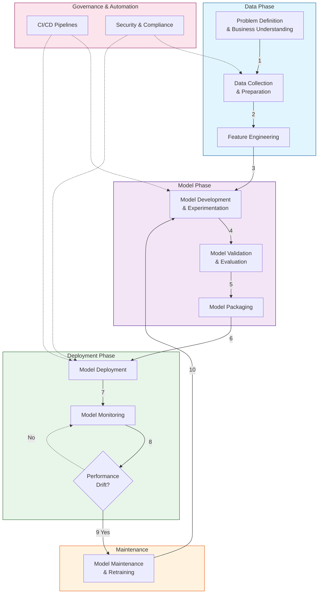
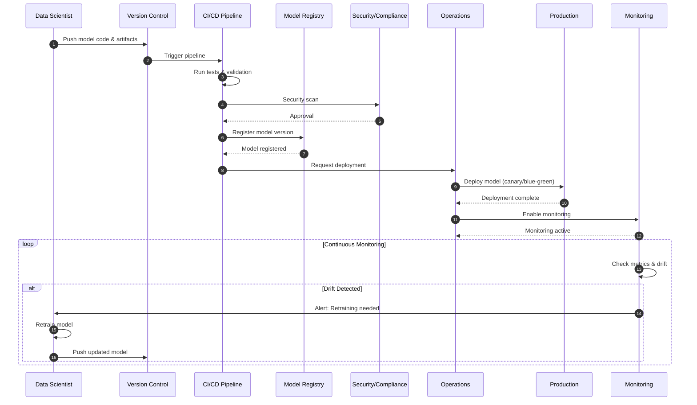

# MLOps 101: A Basic Tutorial

## Introduction

MLOps (Machine Learning Operations) is a set of practices that combines Machine Learning, DevOps, and Data Engineering to streamline the deployment, monitoring, and management of ML models in production. It bridges the gap between data science experimentation and reliable production systems by establishing standardized processes for the entire machine learning lifecycle.

This tutorial provides a foundational overview of the MLOps lifecycle, explaining each stage from problem definition to ongoing model maintenance.

## Visual Guide

The following diagram illustrates the standard MLOps lifecycle activities:

## Stage Breakdown

Below is a detailed explanation of each stage shown in the diagram:

### 1. Problem Definition & Business Understanding

This is the foundational stage where specific business objectives are identified (e.g., "predict stock price movements"). Success metrics are defined here to guide the rest of the project. Clear problem definition ensures alignment between technical solutions and business goals.

### 2. Data Collection & Preparation

Raw data is gathered from various sources. This stage involves cleaning, formatting, and versioning the data to ensure it is usable for training. Data quality directly impacts model performance, making this a critical step in the pipeline.

### 3. Feature Engineering

Raw data is transformed into meaningful features that machine learning algorithms can understand. This includes normalization, encoding, and selecting the most relevant variables. Effective feature engineering often has the largest impact on model performance.

### 4. Model Development & Experimentation

Data scientists select architectures, train models, and tune hyperparameters. Experiment tracking is crucial here to log parameters, metrics, and results. This iterative process helps identify the best-performing model configurations.

### 5. Model Validation & Evaluation

The model is tested against a holdout dataset to ensure it performs well on unseen data. This stage includes automated testing to verify code robustness and model quality before moving forward to deployment.

### 6. Model Packaging

The model and its dependencies are bundled into a deployable format, often using containers (e.g., Docker). This ensures the environment is reproducible and consistent across development, testing, and production environments.

### 7. Model Deployment

The packaged model is released into a production environment. This could be as a REST API, batch processing pipeline, or embedded system. Deployment strategies may include canary releases, blue-green deployments, or A/B testing.

### 8. Model Monitoring

Once live, the model is continuously monitored for performance degradation, errors, latency issues, and data drift. Effective monitoring enables early detection of problems before they significantly impact business outcomes.

## Model Deployment Pipeline

The following sequence diagram shows the interactions between teams and systems during model deployment:

### 9. Model Maintenance & Retraining

If monitoring detects "drift" (where the model's accuracy drops because real-world data has changed), the model is retrained on new data. This triggers a loop back to the development stage, creating a continuous improvement cycle.

### 10. Governance & Automation

- **CI/CD Pipelines**: Continuous Integration and Deployment pipelines automate testing, validation, and deployment tasks, ensuring consistent and reliable releases.
- **Security & Compliance**: Ensuring data privacy, access controls, and regulatory compliance throughout the entire lifecycle.

## Future Steps

This tutorial will expand to include:

- Code examples demonstrating each stage of the MLOps lifecycle
- Sample workflows for automated model training and deployment
- Integration with popular MLOps tools and platforms
- Best practices for model versioning and experiment tracking
- Hands-on exercises for building end-to-end ML pipelines
