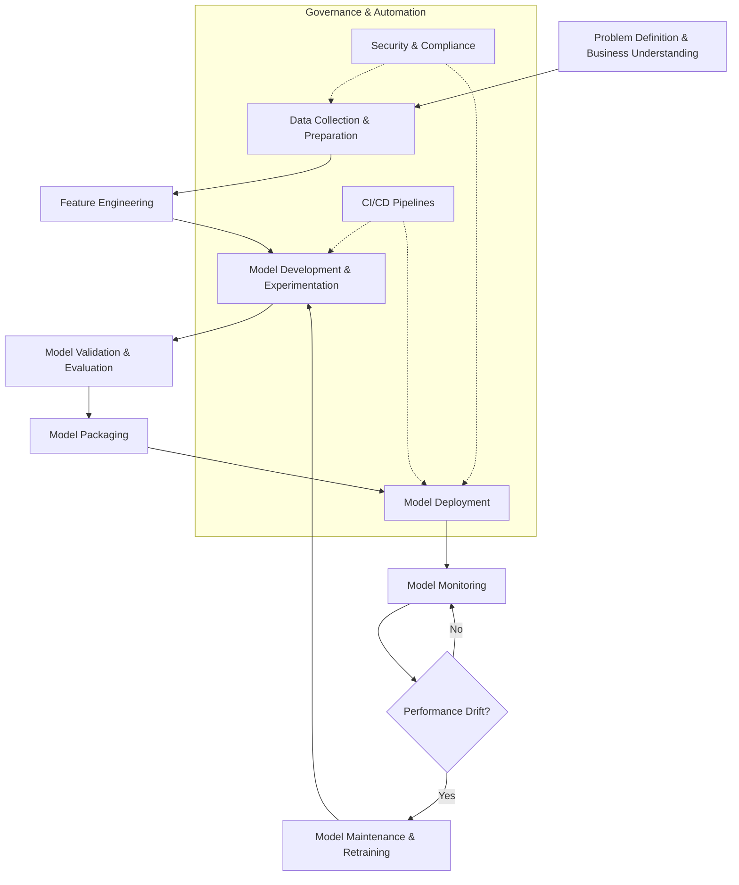

# MLOps 101

This repository is a basic tutorial on MLOps concepts and workflows. It provides an introduction to the key stages and activities involved in operationalizing machine learning models.

### MLOps Lifecycle Diagram

### Detailed Breakdown

1.  **Problem Definition & Business Understanding**: Identify specific business objectives and success metrics.

2.  **Data Collection & Preparation**: Gather, clean, format, and version raw data.

3.  **Feature Engineering**: Transform raw data into meaningful features (normalization, encoding, etc.).

4.  **Model Development & Experimentation**: Select architectures, train models, tune hyperparameters, and track experiments.

5.  **Model Validation & Evaluation**: Test against holdout datasets and run automated tests.

6.  **Model Packaging**: Bundle the model and dependencies (e.g., Docker, requirements.txt).

7.  **Model Deployment**: Release to production (REST API, batch process, etc.).

8.  **Model Monitoring**: Track performance degradation, errors, or latency.

9.  **Model Maintenance & Retraining**: Handle "drift" by retraining on new data.

10. **Governance & Automation**: CI/CD pipelines for testing/deployment and security checks for data privacy.

## Future Steps

More tutorial steps coming soon...
